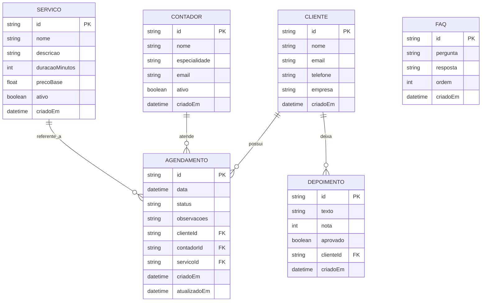

# ConnectContábil

## Integrantes da equipe

- Bernardo Cardoso Vieira
- Cauã Almeida Loiola
- Cintia Trindade Coelho
- Emanuelly
- Nayla

## Tema do sistema

O ConnectContábil é uma landing page com sistema de agendamento inteligente para
escritórios de contabilidade. O site apresenta os serviços do escritório e
permite que o visitante marque uma consulta diretamente, integrando o contato
via WhatsApp com a organização interna dos horários dos contadores.

## Usuários

- **Clientes**: empresas locais e empreendedores (incluindo MEIs) que buscam
  serviços contábeis rápidos e confiáveis.
- **Equipe interna**: contadores do escritório, responsáveis por atender os
  agendamentos feitos pelo site.

## Problema que o sistema resolve

Escritórios contábeis tradicionais sofrem com baixa presença digital, o que
limita a captação de clientes, e com agendamentos manuais (telefone, papel),
que geram atrasos e desorganização interna de horários. O ConnectContábil
resolve isso com uma landing page responsiva, focada em conversão, e um fluxo
de agendamento estruturado que organiza clientes, contadores e serviços em um
único banco de dados.

---

## Modelo Conceitual


### Entidades

**Cliente** representa a empresa local ou o empreendedor que contrata os
serviços do escritório. Guarda nome, e-mail (usado como identificador de
contato), telefone e empresa — os dois últimos são opcionais porque nem todo
cliente informa telefone no primeiro contato pelo site, e nem todo cliente é
uma empresa formalizada (pode ser um MEI ainda sem razão social).

**Contador** representa o profissional do escritório que realiza os
atendimentos. Existe para organizar a agenda interna por especialista
(ex: Fiscal, Trabalhista) e permite marcar um contador como inativo sem
apagar o histórico de atendimentos já realizados.

**Servico** representa cada tipo de consulta oferecida no site (ex: Abertura
de Empresa, Consultoria Tributária, Folha de Pagamento), correspondendo à
seção "Serviços" da landing page. Guarda duração estimada e preço base, que é
opcional porque alguns serviços são cobrados "sob consulta".

**Agendamento** é o núcleo do sistema: representa a consulta marcada por um
cliente, associada a um serviço específico e a um contador responsável. Guarda
data, status do atendimento e observações opcionais do cliente.

**Depoimento** representa a prova social exibida na landing page, sempre
vinculada a um cliente que já foi atendido. Passa por um campo de aprovação
antes de ser publicado no site.

**Faq** representa as perguntas frequentes exibidas na seção de FAQ do site.
Não se relaciona com as demais entidades por ser conteúdo institucional
independente do fluxo de clientes e agendamentos.

### Relacionamentos e cardinalidades

- Um **Cliente** pode ter vários **Agendamentos**, mas cada **Agendamento**
  pertence a um único **Cliente**.
- Um **Contador** pode atender vários **Agendamentos**, mas cada
  **Agendamento** é atribuído a um único **Contador**.
- Um **Servico** pode estar associado a vários **Agendamentos**, mas cada
  **Agendamento** se refere a um único **Servico**.
- Um **Cliente** pode deixar vários **Depoimentos**, mas cada **Depoimento**
  pertence a um único **Cliente**.
- **Faq** não se relaciona com nenhuma outra entidade.

---

## Modelo Lógico

O modelo lógico está representado em [`prisma/schema.prisma`](prisma/schema.prisma),
com todas as entidades, tipos, chaves primárias, relacionamentos (`@relation`)
e campos opcionais justificados por regra de negócio.



---

## Modelo Físico

O modelo físico é o banco PostgreSQL rodando no [Neon](https://neon.tech),
construído a partir das migrations versionadas em
[`prisma/migrations/`](prisma/migrations/) e populado pelo script
[`prisma/seed.js`](prisma/seed.js).

Para reproduzir localmente:

```bash
cp .env.example .env
# edite .env com a connection string real do Neon

npx prisma migrate dev
npx prisma db seed
npx prisma studio
```

### Evidência funcional

> Adicionar aqui o print do Prisma Studio (ou do painel do Neon) mostrando as
> tabelas criadas e populadas após rodar `migrate dev` + `db seed`.

`[ inserir print aqui ]`
